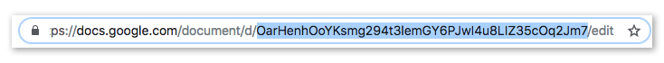

# Gootenberg
A tool for handling news developer needs from the Google API.

## Why This?
Because news developers are writing their own utilities to process data from Google Drive for  special projects rigs, and we can make something better if we stop all that duplication.

## Installation

Install the package

```
$ npm install @politico/gootenberg
```

## Usage

Create a [Google Doc](https://www.google.com/docs/about/). Share it with your Google service account's client email (see [Authenticating](docs/GoogleServiceAccount.md)). Get the Doc ID for that document. You can find it in the URL between `d/` and `/edit` like this:



Import it, create a new instance of `Gootenberg`, authenticate it with your Google credentials account, and run one of its asynchronous functions.

```javascript
import Gootenberg from '@politico/gootenberg';
import credentials from './credentials.json'

async function myFunc(){
  const goot = new Gootenberg();
  await goot.auth(credentials);

  const data = await goot.parse.archie('MY_DOC_ID');
}
```

## Methods

- [auth](docs/auth.md)

### docs
- [append](docs/docs.append.md)

### drive
- [comments](docs/drive.comments.md)
- [export](docs/drive.export.md)
- [files](docs/files.export.md)

### parse
- [archie](docs/parse.archie.md)
- [table](docs/parse.table.md)

### sheets
- [getAll](docs/sheets.archie.md)

## Developing & Contributing
If you'd like to contribute, check out [these docs](docs/Developing).
