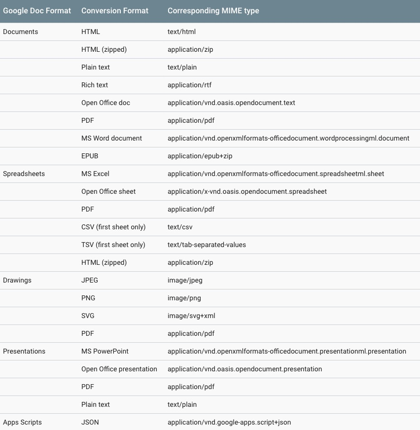

# drive.export(id, \[mimeType = "text/plain"\])

Get the contents of a Google Drive file.

- `id` `<String>`: The Id for a Google Drive file (see [here](../README.md#usage))
- `mimeType` `<String>`: The format in which to download a file (see table below)

## Example
```javascript
import Gootenberg from 'gootenberg';
import credentials from './credentials.json'

async function myFunc(){
  const goot = new Gootenberg();
  await goot.auth(credentials);

  const data = await goot.drive.export('MY_DOC_ID');
  console.log(data);
}

myFunc();
```

## Example Data
```json
"Lorem ipsum dolor sit amet, consectetur adipisicing elit, sed do eiusmod tempor incididunt ut labore et dolore magna aliqua. Ut enim ad minim veniam, quis nostrud exercitation ullamco laboris nisi ut aliquip ex ea commodo consequat. Duis aute irure dolor in reprehenderit in voluptate velit esse cillum dolore eu fugiat nulla pariatur. Excepteur sint occaecat cupidatat non proident, sunt in culpa qui officia deserunt mollit anim id est laborum."
```

## MIME Types
As of March 2019, Google offers the following MIME types:



*Source: [Google Drive API Docs.](https://developers.google.com/drive/api/v3/manage-downloads)*
